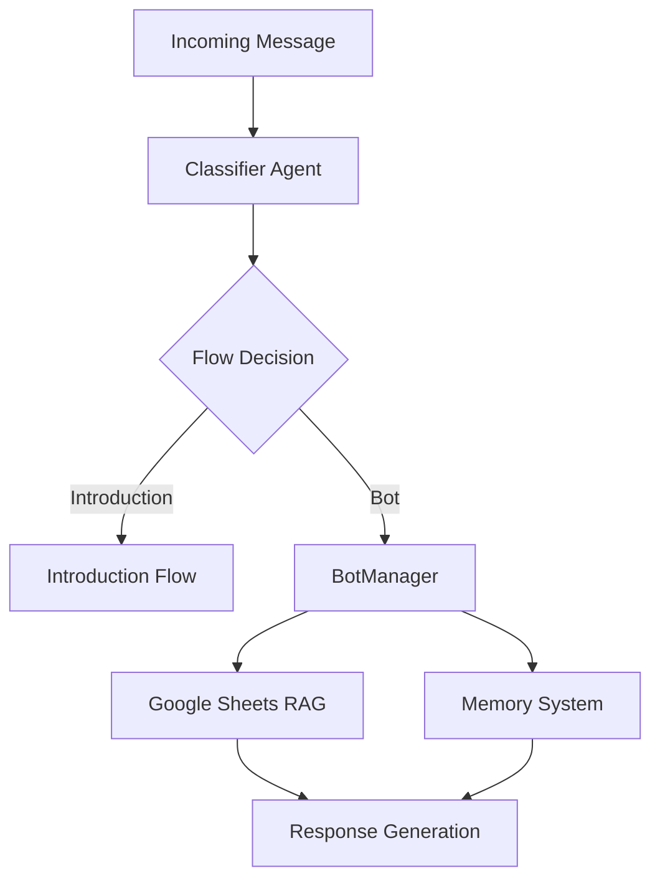

# Migration Plan: n8n to LangChain WhatsApp Bot

## Project Structure
```
project_root/
├── app/
│   ├── __init__.py
│   ├── agents/
│   │   ├── __init__.py
│   │   ├── classifier.py     # Classifier agent (like n8n AI Agent node)
│   │   └── manager.py        # Main conversation manager
│   ├── memory/
│   │   ├── __init__.py
│   │   └── buffer.py        # LangChain Buffer Memory with timeout
│   ├── chains/
│   │   ├── __init__.py
│   │   └── conversation.py  # Main conversation orchestrator
│   ├── tools/
│   │   ├── __init__.py
│   │   └── sheets.py       # Google Sheets RAG tool
│   └── config/
│       ├── settings.py      # Application settings
│       └── prompts.py       # Centralized prompt management
├── tests/
├── .env
└── app.py                   # Main Flask application
```

## Phase 1: Core Components ✓
### Week 1: Classifier Agent ✓
- [x] Set up project structure
- [x] Implement ClassifierAgent with LangChain
- [x] Add structured output parsing
- [x] Create basic API endpoint
- [ ] Add test suite for classifier

### Week 2: Memory System ✓
- [x] Implement ConversationBufferMemory
- [x] Create memory management system
- [x] Add conversation timeout handling
- [x] Implement memory cleanup

### Week 3: Main Conversation Manager ✓
- [x] Create BotManager using LangChain
- [x] Integrate with memory system
- [x] Add conversation tools
- [x] Implement response generation
- [x] Add fallback mechanisms

## Phase 2: RAG Integration (Current Phase)
### Week 4: Google Sheets Integration
- [ ] Create Google Sheets service account
- [ ] Set up Google Sheets API access
- [ ] Create treatment information spreadsheet
- [ ] Implement sheets.py tool:
  ```python
  class GoogleSheetsRAG:
      def __init__(self):
          # Initialize Google Sheets client
          # Load treatment information
          pass
          
      async def query(self, question: str) -> str:
          # Search relevant information
          # Format response
          pass
  ```
- [ ] Add RAG tool to BotManager
- [ ] Update prompts to use RAG responses

### Week 5: Flow Management
- [ ] Create flow routing system
- [ ] Implement introduction flow
- [ ] Add bot conversation flow
- [ ] Create appointment flow
- [ ] Add flow transitions

### Week 6: External Integrations
- [ ] Add WhatsApp API integration
- [ ] Implement Calendly integration
- [ ] Add media handling
- [ ] Create notification system
- [ ] Implement webhook handling

## Technical Components

### LangChain Components
1. **Agents & Managers** ✓
```python
- ClassifierAgent: Determines message flow
- BotManager: Handles main conversation
```

2. **Memory** ✓
```python
- ConversationBufferMemory: In-memory conversation history with timeout
```

3. **Chains** ✓
```python
- ConversationChain: Main orchestrator
```

4. **Tools** (In Progress)
```python
- GoogleSheetsRAG: Treatment information retrieval
```

### Integration Points
1. **External APIs**
- WhatsApp Business API
- OpenAI API
- Google Sheets API
- Calendly API

### Flow Architecture


## Current Status
- ✓ Project structure established
- ✓ Classifier agent implemented
- ✓ Memory system implemented
- ✓ BotManager implemented
- ✓ Conversation chain working
- ✗ Google Sheets RAG pending
- ✗ External integrations pending

## Next Steps
1. Implement Google Sheets RAG tool
2. Create treatment information spreadsheet
3. Integrate RAG with BotManager
4. Add external integrations

## Success Metrics
- Response accuracy > 95%
- Classification accuracy > 98%
- Response time < 2s
- RAG retrieval accuracy > 90%

## Risk Management
1. **Technical Risks**
- Google Sheets API rate limits
- Memory management
- Flow transitions

2. **Mitigations**
- Implement caching for Sheets data
- Memory timeout handling
- Error recovery

## Post-Migration
1. **Optimization**
- RAG performance tuning
- Response caching
- Cost optimization

2. **Documentation**
- System documentation
- API documentation
- Maintenance guides

3. **Training**
- Team training
- Support documentation
- Troubleshooting guides 