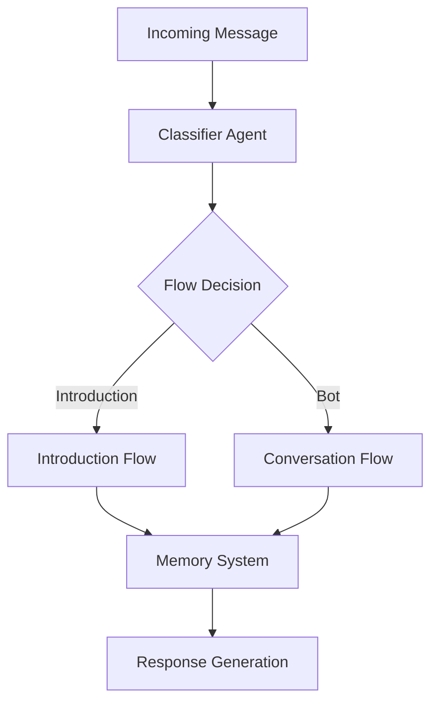

# Migration Plan: n8n to LangChain WhatsApp Bot

## Project Structure
```
project_root/
├── app/
│   ├── __init__.py
│   ├── agents/
│   │   ├── __init__.py
│   │   ├── classifier.py     # Classifier agent (like n8n AI Agent node)
│   │   └── bot.py           # Main conversation agent
│   ├── memory/
│   │   ├── __init__.py
│   │   └── buffer.py        # LangChain Buffer Memory
│   ├── chains/
│   │   ├── __init__.py
│   │   └── conversation.py  # Main conversation chains
│   └── config/
│       ├── settings.py      # Application settings
│       └── prompts.py       # Centralized prompt management
├── tests/
├── .env
└── app.py
```

## Phase 1: Core Components (Current Phase)
### Week 1: Classifier Agent ✓
- [x] Set up project structure
- [x] Implement ClassifierAgent with LangChain
- [x] Add structured output parsing
- [x] Create basic API endpoint
- [ ] Add test suite for classifier

### Week 2: Memory System
- [x] Implement ConversationBufferMemory
- [x] Create memory management system
- [ ] Add conversation timeout handling
- [ ] Implement memory cleanup

### Week 3: Main Conversation Agent
- [ ] Create BotAgent using LangChain
- [ ] Integrate with memory system
- [ ] Add conversation tools
- [ ] Implement response generation
- [ ] Add fallback mechanisms

## Phase 2: Flow Management
### Week 4: Flow System
- [ ] Create flow routing system
- [ ] Implement introduction flow
- [ ] Add bot conversation flow
- [ ] Create appointment flow
- [ ] Add flow transitions

### Week 5: External Integrations
- [ ] Add WhatsApp API integration
- [ ] Implement Calendly integration
- [ ] Add media handling
- [ ] Create notification system
- [ ] Implement webhook handling

## Technical Components

### LangChain Components
1. **Agents**
```python
- ClassifierAgent: Determines message flow
- BotAgent: Handles main conversation
```

2. **Memory**
```python
- ConversationBufferMemory: In-memory conversation history
```

3. **Chains**
```python
- ClassificationChain: Message routing
- ConversationChain: Dialog management
- AppointmentChain: Booking flow
```

### Integration Points
1. **External APIs**
- WhatsApp Business API
- OpenAI API
- DeepSeek API (fallback)
- Calendly API

### Flow Architecture


## Current Status
- ✓ Project structure established
- ✓ Classifier agent implemented
- ✓ Basic API endpoint working
- ✓ Memory system implemented
- ✗ Main agent pending
- ✗ Flow management pending

## Next Steps
1. Add conversation timeout handling
2. Create main conversation agent
3. Implement flow management
4. Add WhatsApp integration

## Success Metrics
- Response accuracy > 95%
- Classification accuracy > 98%
- Response time < 2s

## Risk Management
1. **Technical Risks**
- LLM API reliability
- Memory management
- Flow transitions

2. **Mitigations**
- Model fallbacks
- Memory cleanup
- Error recovery

## Post-Migration

1. **Optimization**
- Memory usage optimization
- Cost optimization
- Feature enhancement

2. **Documentation**
- System documentation
- API documentation
- Maintenance guides

3. **Training**
- Team training
- Support documentation
- Troubleshooting guides 